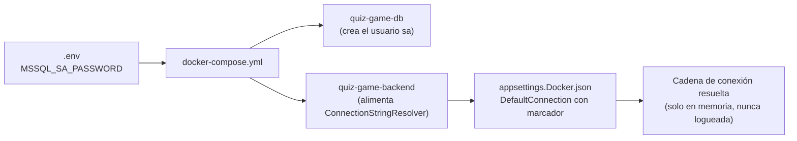

# QuizGame — Ejecución local y con Docker Compose

> Este documento cubre exclusivamente la configuración de infraestructura y los dos modos de
> ejecución (Prompt 09). La descripción general del proyecto, arquitectura y features se añadirá
> en la documentación final (Prompt 15).

## Los dos modos

| Modo | Base de datos | Backend | Frontend |
| --- | --- | --- | --- |
| **Local** | `(localdb)\MSSQLLocalDB` | `dotnet run --launch-profile Local` | `ng serve` / `npm start` |
| **Docker Compose** | SQL Server 2022 en contenedor (`quiz-game-db`) | contenedor `quiz-game-backend` | contenedor `quiz-game-frontend` |

Ambos modos funcionan sin tocar código: solo cambia el perfil de configuración
(`ASPNETCORE_ENVIRONMENT=Local|Docker`).

## Perfiles de configuración

```text
backend/src/QuizGame.Api/
├── appsettings.json            → configuración común (Resilience, Logging), sin cadena de conexión
├── appsettings.Local.json      → modo local (LocalDB, Integrated Security)
└── appsettings.Docker.json     → modo docker-compose (SQL Server en contenedor, marcador de contraseña)
```

**Decisión confirmada:** LocalDB se autentica con `Integrated Security=true` (usuario de Windows).
No admite `User Id`/`Password`, así que esos dos parámetros se omiten deliberadamente en el perfil
Local. `Encrypt=False` es correcto ahí porque la conexión es local por named pipes. El perfil Local
no necesita ninguna variable de entorno de contraseña: no hay credencial que proteger.

### Parámetros de `DefaultConnection` en el perfil Docker

| Parámetro | Valor Docker | Razón |
| --- | --- | --- |
| `Server` | `quiz-game-db,1433` | nombre del servicio en la red de Compose; Docker resuelve el DNS |
| `Database` | `QuizGameDb` | base creada por las migraciones |
| `User Id` | `sa` | usuario administrador de la imagen oficial |
| `Password` | `${MSSQL_SA_PASSWORD}` | marcador; el valor real llega por variable de entorno |
| `TrustServerCertificate` | `True` | el contenedor usa certificado autofirmado |
| `Encrypt` | `True` | cifra el tráfico aunque el certificado no sea de una CA |
| `MultipleActiveResultSets` | `True` | permite múltiples lectores activos sobre una conexión |
| `Connect Timeout` | `30` | margen para el arranque de SQL Server en contenedor |

## Resolución de la contraseña (`ConnectionStringResolver`)

La contraseña vive únicamente en la variable de entorno `MSSQL_SA_PASSWORD`. `appsettings.Docker.json`
contiene la cadena completa **con el marcador** `${MSSQL_SA_PASSWORD}`, nunca con el secreto real.
`ConnectionStringResolver.Resolve(IConfiguration)` se ejecuta en `Program.cs` **antes** de registrar
el `DbContextFactory`:

- Si la cadena no contiene el marcador (perfil Local), la devuelve intacta: un solo camino de código
  para ambos modos.
- Si lo contiene y la variable no está definida, lanza `InvalidOperationException` de inmediato —
  nunca un timeout de conexión difuso a los 30 segundos (verificado: ver sección de pruebas).
- Aplica la contraseña con `SqlConnectionStringBuilder`, nunca por concatenación de strings, para no
  corromper la cadena si el secreto contiene `;`, `'` o `"`.
- Nunca se registra la cadena resuelta en logs ni en excepciones.

**Nota de ubicación:** el resolvedor vive en `QuizGame.Infrastructure.Persistence`, no en
`QuizGame.Api/Extensions` como sugiere el enunciado. La factoría de diseño de EF Core
(`QuizGameDbContextFactory`, usada por `dotnet ef`) necesita reutilizar exactamente la misma lógica
(Prompt 05), e `Infrastructure` no puede depender de `Api`. Se prefirió una sola implementación en la
capa más baja que ambos consumidores alcanzan, en vez de duplicar código para calzar con la ruta
sugerida literalmente.

### Alternativa admitida (no usada como principal)

ASP.NET Core mapea `ConnectionStrings__DefaultConnection` como variable de entorno y sobrescribe el
valor del archivo. Es válido, pero deja la cadena completa —incluido el secreto— dentro del
`docker-compose.yml`, que sí se versiona. El marcador con resolvedor mantiene el secreto en un único
lugar (`.env`, no versionado) y la cadena documentada en `appsettings.Docker.json`. Es una decisión de
seguridad, no de estilo.

## Flujo del secreto



Una sola variable, dos consumidores, cero duplicación. En un entorno real esto iría en Azure Key
Vault, AWS Secrets Manager o Docker Secrets; `.env` es aceptable solo para desarrollo local.

## Comandos

### Modo Local

```powershell
# Base de datos (LocalDB)
cd backend
dotnet tool install --global dotnet-ef
dotnet ef database update --project src/QuizGame.Infrastructure --startup-project src/QuizGame.Api

# API
dotnet run --project src/QuizGame.Api --launch-profile Local

# Frontend (otra terminal)
cd frontend
npm ci
npm start
```

Alternativa sin EF Tools: ejecutar los scripts de `/scripts/database/` en orden con `sqlcmd`.

### Modo Docker Compose

```powershell
# 1. Preparar el secreto (una sola vez)
cp .env.example .env      # y ajusta MSSQL_SA_PASSWORD si quieres otro valor

# 2. Construir y levantar
docker compose up --build -d

# Ver estado y logs
docker compose ps
docker compose logs -f quiz-game-backend

# Verificar que la variable llega al contenedor (sin imprimir el valor)
docker compose exec quiz-game-backend printenv | Select-String "MSSQL_SA_PASSWORD=" | ForEach-Object { "MSSQL_SA_PASSWORD is set" }

# Detener conservando datos
docker compose stop

# Detener y eliminar contenedores (conserva el volumen)
docker compose down

# Reset total, incluidos los datos
docker compose down -v

# Reconstruir solo un servicio
docker compose up --build -d quiz-game-backend
```

URLs resultantes: frontend `http://localhost:8080`, API `http://localhost:5000`, documentación
`http://localhost:5000/scalar/v1`.

## Validado en esta sesión

- `docker compose build quiz-game-backend` — build multi-stage correcto.
- `docker compose up -d quiz-game-db quiz-game-backend` — `quiz-game-db` pasa su healthcheck
  (`sqlcmd`) antes de que `quiz-game-backend` arranque; migraciones aplicadas automáticamente al
  iniciar (perfil `Docker`); `GET /health/ready` y `GET /api/v1/categories` responden `200 OK` con
  las 3 categorías sembradas, a través del puerto publicado `5000`.
- Arrancar el contenedor del backend en perfil `Docker` **sin** `MSSQL_SA_PASSWORD` falla de
  inmediato con `InvalidOperationException: Environment variable 'MSSQL_SA_PASSWORD' is required by
  the current profile.` — no hay timeout de conexión difuso.
- Modo Local: `dotnet ef database update` + `dotnet run --launch-profile Local` contra
  `(localdb)\MSSQLLocalDB`, base `QuizGameDb`; `GET /health/live` y `GET /api/v1/categories`
  responden `200 OK`.
- El frontend (`quiz-game-frontend`) aún no se puede construir: el proyecto Angular se crea en el
  Prompt 10. El `Dockerfile`/`nginx.conf` están listos para cuando exista `frontend/package.json`.
